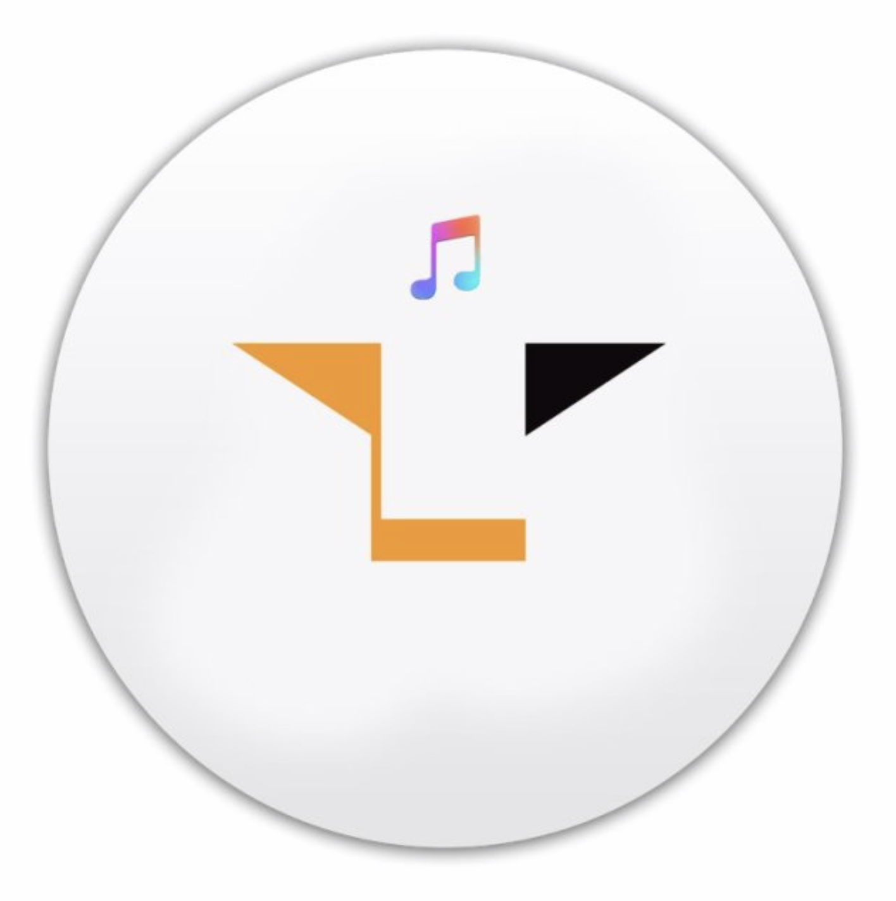
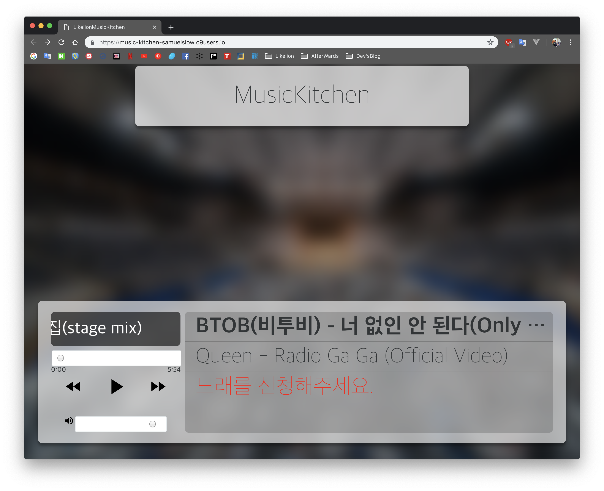
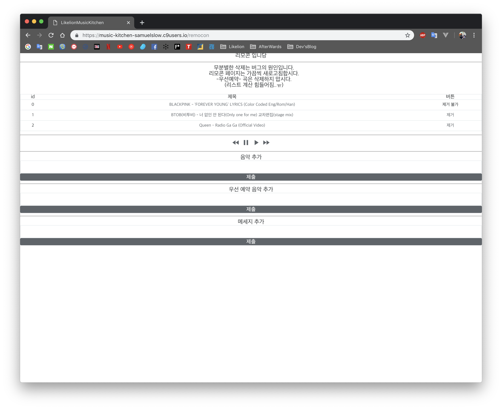

    

<h1 align="center">뮤직키친-카톡 플친 플레이리스트 공유 서비스</h1>

    
    
    

## Overview

카카오톡 플러스친구 API를 활용해 친구와의 플레이리스트 공유 서비스 

## Usage

`카카오톡`에서 `뮤직키친` 검색 후 친구추가하여 이용 가능

~~현재 1개의 리전만 지원하지만 차후 행사별로 사용할 수 있게 할 예정~~

## Feature

* 전광판을 위해 만들어진 서비스로 글자 크기가 크다
* 비동기처리로 새로고침하지 않고 사용
* 향후 플레이리스트 참가자들의 노래목록을 통계로 확인 가능
* 관리자를 위한 노래 조작 리모콘 페이지 제공
